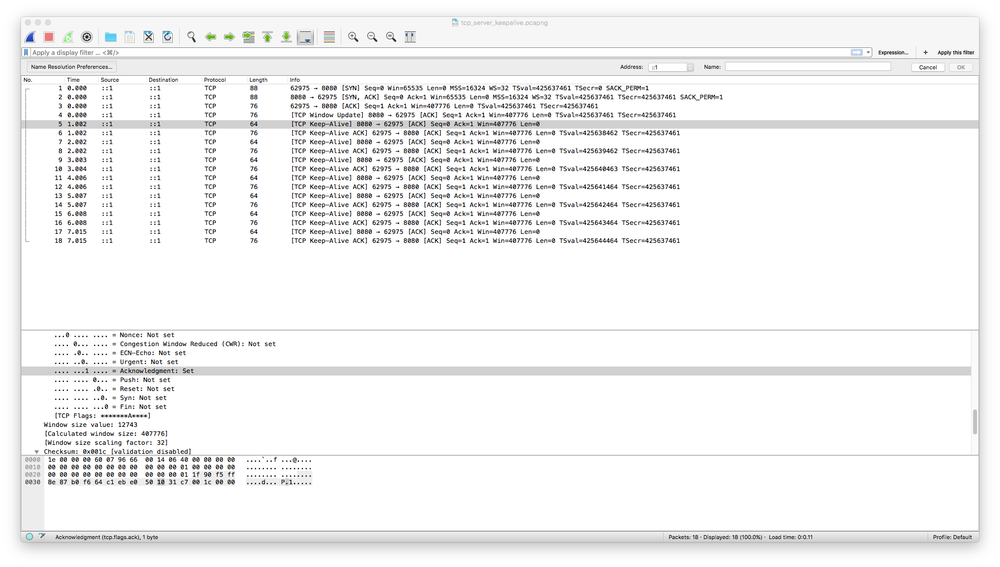

帮忙理解 TCP Keepalive


Wireshark 抓包，选择 Lookback:lo0 接口：


然后运行服务端

	go run server/main.go 


接着打开另一个终端，用 telnet 充当客户端：

	telnet localhost 8080


观察wireshark 窗口





如果希望在 client 端启动 keepalive，用 go run client/main.go 代替 telnet 
并且注释掉 server/main.go 的以下代码：

```go
tcpConn, ok := conn.(*net.TCPConn)
	if ok {
		tcpConn.SetKeepAlive(true)
		tcpConn.SetKeepAlivePeriod(time.Second)
	}
```


References:

1. http://www.tldp.org/HOWTO/html_single/TCP-Keepalive-HOWTO/#overview
2. http://www.blogjava.net/yongboy/archive/2015/04/14/424413.html
3. http://www.firefoxbug.com/index.php/archives/2805/